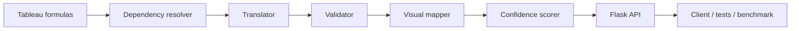

# Office Soln AI — BI Migration Engine

## 1. Objective

This project builds a small, explainable migration engine for converting Tableau-style calculations into DAX expressions for Power BI. The aim is to speed up the handoff from Tableau dashboards to Power BI models while preserving business logic, surfacing unsupported patterns, and flagging semantic risk early.

The engine focuses on real-world migration tasks such as aggregations, conditional logic, fixed-level-of-detail expressions, and table-calculation approximations. It also provides a validation layer so the system can detect when a formula is reversed, incomplete, or needs manual review.

## 2. Problem Statement

Tableau and Power BI both use formula-based logic, but their semantics are not identical. Tableau formulas often include patterns such as:

- aggregate functions like SUM and AVG over fields inside brackets
- IF / THEN / ELSE / END logic
- FIXED LOD expressions
- WINDOW_SUM and RUNNING_SUM behaviors
- context-sensitive calculations that depend on partitions and ordering

Power BI/DAX uses a different expression model. Many Tableau expressions cannot be translated one-to-one without additional assumptions. The migration challenge is therefore not only syntax conversion but also semantic equivalence, dependency awareness, and validation.

This project addresses that challenge with a rule-based, deterministic translation layer plus a confidence and validation pipeline to make the converted output auditable.

## 3. Approach

The migration pipeline follows a practical, staged approach:

1. Parse the Tableau source formula.
2. Detect and normalize supported Tableau constructs.
3. Resolve dependency order across multiple calculations.
4. Translate supported Tableau patterns into DAX-style output.
5. Validate the generated DAX against the existing DAX or expected pattern.
6. Detect common mistakes such as reversed numerator/denominator logic.
7. Map the result to a supported visual type.
8. Calculate a confidence score and include human-readable reasons.
9. Return the result in a structured JSON response through the API.

This is intentionally a pragmatic prototype rather than a complete Tableau parser. It handles the core patterns most commonly seen in BI migration work while documenting limitations clearly.

## 4. Architecture



The architecture is modular and follows a clear flow:

- parser / formula interpretation
- dependency resolution
- translation rules
- validation and correction
- visual mapping
- confidence scoring
- API output

## 5. Design Decisions

Several design choices were made to keep the engine useful and testable:

- Rule-based translation: fast, deterministic, and transparent.
- Modular architecture: each concern lives in a separate file.
- Validation-first workflow: the engine checks for common formula errors such as reversed ratios.
- Confidence scoring: results are not just converted — they are explained.
- Explicit approximation: if a Tableau feature depends on partitioning or ordering, the engine flags it as an approximation rather than pretending it is exact.
- API-first workflow: the logic is exposed through a standard Flask endpoint for integration testing.

This keeps the system understandable and robust enough for a prototype that supports real migration scenarios without overengineering a full Tableau parser.

## 6. Supported Tableau Expressions

The current implementation supports a focused set of expressions that are common in dashboard migration work:

- `SUM([Sales])`
- `AVG([Sales])`
- `MIN([Sales])`
- `MAX([Profit])`
- `COUNT([OrderID])`
- `IF [B] > 0.2 THEN 'High' ELSE 'Low' END`
- `{FIXED [Region]: SUM([Sales])}`
- `WINDOW_SUM(SUM([Profit]))`
- `RUNNING_SUM(SUM([Sales]))`

The engine converts these patterns to equivalent DAX-style output wherever the semantics are compatible. Some table-calculation patterns are treated as approximations rather than exact Tableau-equivalent behavior.

## 7. Dependency Resolution

The system resolves dependencies by evaluating the set of formulas and ordering calculations so that referenced metrics are translated in the correct order.

Example:

- `A = SUM([Sales]) - SUM([Cost])`
- `B = [A] / SUM([Sales])`

The engine detects that `B` depends on `A` and resolves the graph before translating the formulas. This prevents broken output caused by translating in the wrong order.

The `resolve_dependencies` step is used inside the migration engine before any translation happens.

## 8. DAX Validation & Correction

Validation is a key part of the engine. It checks whether the generated DAX matches the expected logic and it catches a common issue: reversed numerator/denominator formulas.

Example:

- Tableau source: `SUM([Profit]) / SUM([Sales])`
- Existing DAX: `SUM(Sales) / SUM(Profit)`

The validator detects the reversed ratio and replaces it with the corrected output:

```text
SUM(Profit) / SUM(Sales)
```

This is exactly the type of semantic bug the system is designed to catch and correct.

## 9. Visual Mapping

The project also maps Tableau visual types to a Power BI-friendly interpretation.

Examples:

- `bar` → `Clustered bar chart`
- `line` → `Line chart`
- `pie` → `Pie chart`
- `kpi` → `KPI`
- `table` → `Table`

The engine stores this in the response to make it easier to understand whether the translated metric is likely to fit the target visual context.

## 10. Confidence Scoring

Every migration result is assigned a confidence score and a level.

The scoring logic currently uses:

- dependency resolution success: +0.20
- translation success: +0.35
- validation score: +0.25 * validation_score
- visual support: +0.10
- ambiguity penalty: -0.10 * ambiguity

Thresholds:

- `>= 0.85` → `HIGH`
- `>= 0.65` → `MEDIUM`
- otherwise → `LOW`

This gives the user a practical risk signal without overstating certainty.

## 11. Benchmark / Evaluation

The benchmark layer evaluates the migration engine against a set of representative formulas stored in the project data folder. These cases include:

- aggregation formulas
- ratio formulas
- conditional logic
- fixed LOD cases
- window and running calculations

The benchmark compares:

- before correctness: whether the existing DAX is already correct
- after correctness: whether the corrected output matches the expected DAX
- improvement: the delta between the two outcomes

## 12. Before vs After Accuracy

The current benchmark result, based on the project dataset, is:

- Total cases: 10
- Before correct: 1
- After correct: 10
- Before accuracy: 10.0%
- After accuracy: 100.0%
- Improvement: +90.0%

This is a strong indicator that the engine materially improves the correctness of migration output in the supported expression set.

## 13. Sample Output

The engine produces a structured JSON result from the Flask API. Here is a real response captured from the current project:

```json
{
  "result": {
    "confidence_level": "MEDIUM",
    "confidence_reasons": [
      "Dependencies resolved successfully",
      "Tableau formula translated successfully",
      "Incorrect existing DAX was detected and corrected",
      "Visual type mapped successfully"
    ],
    "confidence_score": 0.68,
    "dependency_order": ["KPI_1"],
    "is_corrected": true,
    "predicted_dax": "SUM(Profit) / SUM(Sales)",
    "reason": "Numerator and denominator are reversed.",
    "translated_calculations": {
      "KPI_1": "SUM(Profit) / SUM(Sales)"
    },
    "validation_score": 0.1,
    "visual_mapping": "Clustered bar chart"
  },
  "success": true
}
```

## 14. Error Analysis

The system is designed to detect and explain common migration issues instead of silently producing bad DAX.

Major classes of issues include:

- reversed ratio logic
- unsupported or ambiguous tableau constructs
- nested expressions that need approximation
- missing dependency ordering
- visual mismatches in the target format

For example, if the source formula is `SUM([Profit]) / SUM([Sales])` and the existing DAX is reversed, the validator flags the issue and returns the corrected DAX with a reason. This makes the migration engine more transparent and safer for real use.

## 15. Limitations

This is a prototype and it does not attempt to fully replace a mature Tableau parser or full-blown semantic analyzer.

Current limitations include:

- deep nesting is still limited and may require approximation
- window and running calculations depend on Tableau partitioning and ordering metadata
- expression semantics may differ slightly from exact Tableau behavior
- not every Tableau function is supported yet
- some formulas still need human review for full business equivalence

The project explicitly documents these limitations instead of pretending to support all cases.

## 16. Future Improvements

The next step for a production-grade version would include:

- broader Tableau function coverage
- better parsing for nested logic blocks
- richer validation heuristics
- improved handling of `WINDOW_SUM` and `RUNNING_SUM`
- benchmark expansion with more real-world formulas
- UI-based inspection of translated results
- integration with Power BI metadata and semantic model validation

## 17. Installation

Clone the repository and set up a virtual environment.

### Windows PowerShell

```powershell
git clone https://github.com/<your-user>/<your-repo>.git
cd office-soln-ai-bi-migration-engine
python -m venv venv
.\venv\Scripts\Activate.ps1
python -m pip install -r requirements.txt
```

### Linux / macOS

```bash
git clone https://github.com/<your-user>/<your-repo>.git
cd office-soln-ai-bi-migration-engine
python -m venv venv
source venv/bin/activate
pip install -r requirements.txt
```

## 18. Running the API

Start the Flask API from the project root:

```bash
python app/api.py
```

or with the virtual environment activated:

```powershell
.\venv\Scripts\python.exe app\api.py
```

The service exposes:

- `GET /api/health`
- `POST /api/migrate`

## 19. API Usage

### Request example

```json
{
  "calculations": [
    {
      "name": "KPI_1",
      "formula": "SUM([Profit]) / SUM([Sales])"
    }
  ],
  "target_calculation": "KPI_1",
  "existing_dax": "SUM(Sales) / SUM(Profit)",
  "visual": {
    "visual_type": "bar",
    "dimensions": ["Region"],
    "measures": ["KPI_1"]
  }
}
```

### Response example

```json
{
  "success": true,
  "result": {
    "predicted_dax": "SUM(Profit) / SUM(Sales)",
    "is_corrected": true,
    "confidence_score": 0.68,
    "confidence_level": "MEDIUM",
    "confidence_reasons": [
      "Dependencies resolved successfully",
      "Tableau formula translated successfully",
      "Incorrect existing DAX was detected and corrected",
      "Visual type mapped successfully"
    ]
  }
}
```

## 20. Testing

The project includes automated tests for the API, translator, validator, confidence logic, and benchmark behavior.

Run the project tests:

```bash
pytest
```

Actual verified result from the current project run:

```text
14 passed in 1.06s
```

## 21. Project Structure

```text
office-soln-ai-bi-migration-engine/
├── app/
│   ├── __init__.py
│   ├── api.py
│   ├── benchmark.py
│   ├── confidence.py
│   ├── dependency.py
│   ├── engine.py
│   ├── models.py
│   ├── parser.py
│   ├── translator.py
│   ├── validator.py
│   └── visual_mapper.py
├── data/
│   ├── benchmark_cases.json
│   └── sample_input.json
├── docs/
│   └── error-analysis.md
├── tests/
│   ├── test_api.py
│   ├── test_benchmark.py
│   ├── test_confidence.py
│   ├── test_engine.py
│   ├── test_validator.py
│   └── test_visual_mapper.py
├── .gitignore
├── .vscode/
│   └── settings.json
├── pytest.ini
├── pyrightconfig.json
├── README.md
├── requirements.txt
└── venv/
```

## 22. Conclusion

This project demonstrates a practical, modular approach to Tableau-to-DAX migration. It does not claim full semantic parity for every Tableau expression, but it does show that a rule-based migration engine can successfully handle a meaningful subset of real-world formulas, detect common logic errors, and return a structured, auditable output that is easy to integrate into BI modernization workflows.

The system is best viewed as a working prototype for accelerating migration work and identifying where human review is still required.
